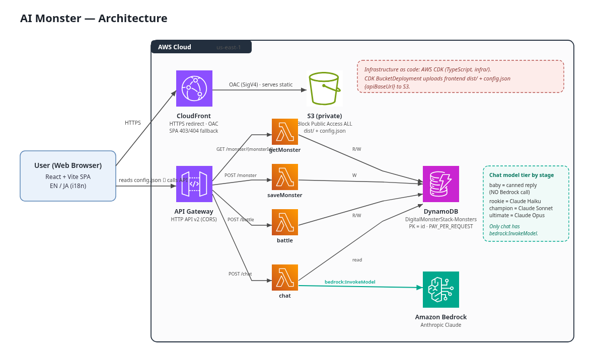

# AIモンスター / AI Monster 🥚🐉

**English** | [日本語](README.ja.md)

A Digimon-style raising game. Hatch a monster from an egg, raise it through care actions (feeding, training, sleeping, cleaning) and battles, and watch it evolve as it reaches new growth stages. From the Rookie stage onward you can chat with your monster using **Amazon Bedrock (Claude)**, and the model switches to a smarter tier as the monster grows.

> This is a submission project for the **Kiro University Challenge**. It is a TypeScript monorepo + AWS CDK one-command deploy setup.
>
> 📝 **For reviewers**: how each lesson is demonstrated and in which deliverable is summarized in [`SUBMISSION.md`](./SUBMISSION.md).

---

## 🎮 Overview

- 🥚 **Hatch → Grow → Evolve**: the appearance (SVG sprite) changes at every growth stage.
- 🍖 **Care**: feeding, training, sleeping, and cleaning with a single tap.
- ⚔️ **Battle**: a simple battle against an enemy monster. Win/loss changes the stats.
- 📊 **Stats**: HP, attack (ATK), defense (DEF).
- ⏰ **Time passing**: the state changes according to how long you leave it (a lightweight take on real-time raising).
- 💾 **Save**: data is stored in DynamoDB keyed by a `monsterId` issued per browser. No authentication.
- 💬 **Conversational AI**: the Bedrock Claude model switches according to the growth stage.
- 🔊 **Sound & settings**: short sound effects for care, battle, and evolution, plus a settings panel (sound on/off and volume, reduced motion, language) saved to `localStorage`.

> **Sound asset license:** Sound effects are generated at runtime via the Web Audio API; no third-party audio assets are bundled.

---

## 🏗️ Architecture



The editable diagram is [`docs/architecture.drawio`](docs/architecture.drawio) (open with draw.io / diagrams.net).
A PNG (`docs/architecture.png`) and vector (`docs/architecture.svg`) are included.

- The **browser** (React + Vite SPA, EN/JA i18n) loads the static site from a **private S3** bucket via **CloudFront** (HTTPS, OAC) — the bucket blocks all public access and holds the frontend `dist/` plus a generated `config.json`.
- The SPA reads `/config.json` (`{ "apiBaseUrl": ... }`) at startup, then calls the **API Gateway v2 HTTP API** (CORS enabled).
- The HTTP API routes to **four Lambdas**: `getMonster` (DynamoDB R/W), `saveMonster` (DynamoDB W), `battle` (DynamoDB R/W), and `chat` (DynamoDB R + Bedrock).
- All four Lambdas use a single **DynamoDB table** `DigitalMonsterStack-Monsters` (partition key `id`, `PAY_PER_REQUEST`).
- **Only the `chat` Lambda** calls **Amazon Bedrock** (`bedrock:InvokeModel`, scoped to the Claude inference-profile ARNs). The Claude tier is chosen by growth stage: Baby = none (canned reply, no Bedrock call), Rookie = **Haiku**, Champion = **Sonnet**, Ultimate = **Opus**.
- Everything is codified with **AWS CDK (TypeScript)** and deployed as a single CloudFormation stack with a one-command `cdk deploy`.

Monorepo layout:

| Package | Role |
|---|---|
| `packages/shared` | Types, raising/evolution/battle logic, Bedrock model mapping (pure functions + `node:test`) |
| `packages/backend` | Lambda handlers (getMonster / saveMonster / chat / battle) |
| `packages/frontend` | React + Vite game UI, per-stage SVG sprites, API client |
| `infra` | AWS CDK app |

---

## 🧬 Growth Stages & Bedrock Model Mapping

Evolution conditions are a lightweight judgement based on **training count + elapsed time** (see `packages/shared/src/stages.ts`).

| Growth stage | English name | Conversational AI | Default Bedrock model ID |
|---|---|---|---|
| 幼年期 (egg → baby) | Baby | **no chat** | — (returns a canned cry without calling Bedrock) |
| 成長期 | Rookie | Claude **Haiku** | `us.anthropic.claude-haiku-4-5-20251001-v1:0` |
| 成熟期 | Champion | Claude **Sonnet** | `us.anthropic.claude-sonnet-4-5-20250929-v1:0` |
| 完全体 | Ultimate | Claude **Opus** | `us.anthropic.claude-opus-4-5-20251101-v1:0` |

The default model IDs are defined in `packages/shared/src/bedrock-models.ts` (`BEDROCK_MODEL_IDS`). These are Anthropic Claude **cross-region inference profile IDs** (with the `us.` prefix). Current-generation Claude models cannot be invoked on demand via bare foundation-model IDs; they must be called through an inference profile. Because IDs and availability vary by region/account, they are all overridable. See [Overriding model IDs](#-overriding-model-ids) for how.

---

## ✅ Prerequisites

1. **Node.js >= 18** (20 or later recommended) and npm.
2. An **AWS account** and configured **AWS CLI credentials** (`aws configure`, environment variables, or SSO). Administrator-equivalent permissions on the deploy target account are required.
3. **Enable Amazon Bedrock model access** (most important):
   - Open the AWS console → **Amazon Bedrock** → **Model access** page.
   - Request (enable) access to **Anthropic Claude Haiku / Sonnet / Opus** (the defaults are the Claude 4.5 cross-region inference profiles).
   - Without this, the chat feature (chat Lambda) fails with `AccessDenied`.
4. **Region**: `us-east-1` (N. Virginia) is recommended. Availability of each Claude model and inference profile varies by region, so `us-east-1`, where the `us.`-prefixed profiles are available, is the safest starting point. If you use another region, confirm that the three models above (or your override targets) are available there.

---

## 🚀 Deploy (one command path)

Run the following in order from the repository root.

```bash
# 1) Install dependencies (whole monorepo)
npm install

# 2) Build
#    - compile shared
#    - build frontend with Vite to produce packages/frontend/dist
#    (backend is bundled at deploy time by CDK NodejsFunction/esbuild)
npm run build

# 3) Deploy with CDK
cd infra
npx cdk bootstrap        # only needed once per account/region
npx cdk deploy
```

> You **must run `npm run build` first to generate `packages/frontend/dist`**. The CDK `BucketDeployment` assumes `dist` exists at synth time.

### 🔗 How the frontend and API wire up automatically in a single deploy

At deploy time, CDK places the following into the S3 bucket at the same time:

- the build artifacts from `packages/frontend/dist`
- a generated **`config.json`** (contents: `{ "apiBaseUrl": "<deployed API URL>" }`)

At startup the frontend fetches `/config.json` from the site root and uses its `apiBaseUrl` as the API base URL. Therefore **no pre-build to learn the API URL and no second deploy are needed** — a single `cdk deploy` is enough, and opening the CloudFront URL lets you play right away.

### 📤 Reading the outputs

After `cdk deploy` completes, the stack **Outputs** show the following.

| Output name | Contents |
|---|---|
| `CloudFrontUrl` | the URL to open in your browser (open this to play) |
| `ApiUrl` | the HTTP API base URL (also written into `config.json`) |
| `BucketName` | the S3 bucket name serving the frontend |
| `TableName` | the DynamoDB table name storing save data |

---

## 🔧 Overriding model IDs

The default model IDs live in `packages/shared/src/bedrock-models.ts`. To override them, use an environment variable or CDK context (they are passed only to the chat Lambda).

Override via environment variables:

```bash
export BEDROCK_MODEL_HAIKU=us.anthropic.claude-haiku-4-5-20251001-v1:0
export BEDROCK_MODEL_SONNET=us.anthropic.claude-sonnet-4-5-20250929-v1:0
export BEDROCK_MODEL_OPUS=us.anthropic.claude-opus-4-5-20251101-v1:0
cd infra && npx cdk deploy
```

Override via CDK context:

```bash
npx cdk deploy \
  -c bedrockModelHaiku=us.anthropic.claude-haiku-4-5-20251001-v1:0 \
  -c bedrockModelSonnet=us.anthropic.claude-sonnet-4-5-20250929-v1:0 \
  -c bedrockModelOpus=us.anthropic.claude-opus-4-5-20251101-v1:0
```

`ALLOWED_ORIGIN` (the CORS allowed origin, default `*`) can also be set via an environment variable or the context `-c allowedOrigin=...`. See [`.env.example`](./.env.example) for a configuration example.

---

## 💻 Local development

You can run just the frontend locally against an already-deployed API.

```bash
cd packages/frontend
# use the ApiUrl from the deploy output
echo "VITE_API_BASE_URL=https://xxxxxxxx.execute-api.us-east-1.amazonaws.com" > .env.local
npm run dev
```

At startup the frontend first looks for `/config.json`, and if it is not found it falls back to the build-time `VITE_API_BASE_URL` (see `packages/frontend/.env.example`). If you want to use `config.json` locally, you can also place a `public/config.json`.

Unit tests for the shared logic (dependency-free, `node:test`):

```bash
npm run test   # = npm run test -w @ddm/shared
```

---

## 📱 PWA & care notifications

The app is a Progressive Web App: a hand-rolled web app manifest
(`packages/frontend/public/manifest.webmanifest`) plus a service worker
(`packages/frontend/public/sw.js`) make it **installable** ("Add to Home
Screen") on supported browsers. No build plugin or extra dependency is used;
everything in `public/` is copied verbatim to the deploy root by Vite.

### Service worker caching (CloudFront-safe)

The service worker uses a caching strategy picked so updates always land
correctly behind CloudFront:

- **HTML (navigation requests): network-first.** The app shell is fetched from
  the network first and only falls back to cache when offline, so a fresh
  deploy is picked up on the next load instead of being pinned to a stale
  shell.
- **Hashed static assets (JS/CSS with content hashes): stale-while-revalidate.**
  These are safe to serve from cache immediately while refreshing in the
  background, because a new build emits new hashed filenames.
- **`config.json`: never cached.** The runtime API config is always fetched
  from the network (the app already requests it with `cache: 'no-store'`), so
  a redeploy that rewrites `config.json` is never served a stale value.

CloudFront invalidates `/*` on each deploy, and the service worker registration
is **production-only and feature-detected** (it is skipped under `vite dev` so
local HMR is never confused by SW caching).

### Local "care needed" notifications

When enabled, the app can show a **local** browser notification when the
monster's hunger is projected to reach the caution level, so you get a nudge to
come back and feed it even with the tab in the background.

- **Permission is only ever requested from a user gesture** — the Notifications
  toggle in Settings. The app never prompts for permission on load.
- **Default OFF.** Nothing is requested or scheduled until you opt in.
- **Fully optional / graceful.** With notifications off, denied, or on a browser
  that does not support the Notification API, the game works exactly the same
  with no errors.
- **Notifications are LOCAL — there is no push server and no VAPID.** A
  notification is scheduled with `setTimeout` and only fires while a tab is
  alive; closing every tab simply means no notification fires.

---

## 🧹 Teardown

```bash
cd infra
npx cdk destroy
```

The DynamoDB table and S3 bucket are created with `removalPolicy: DESTROY` (S3 with `autoDeleteObjects: true`) for development, so their data is deleted together with the stack. For production use, change the `removalPolicy` in `infra/lib/digital-monster-stack.ts` to `RETAIN`.

---

## ✅ Build & deploy status

This project has been **actually built and deployed** using the flow in "Deploy" above (`npm install` → `npm run build` → `cd infra && npx cdk bootstrap && npx cdk deploy`).

- `npm install` / `npm run build` (`shared` → `backend` → `frontend` → `infra`) pass green.
- `packages/frontend/dist` is generated by Vite, and the CDK `BucketDeployment` picks it up at synth time.
- `npx cdk bootstrap` → `npx cdk deploy` succeeds and deploys a stack that includes CloudFront distribution + API Gateway + DynamoDB + Bedrock IAM. After deploy, the `cdk deploy` **Outputs** (`CloudFrontUrl` / `ApiUrl` and others) are shown, and opening `CloudFrontUrl` lets you play right away.

> The concrete CloudFront / API URLs are freshly issued per account and region on every deploy, so no fixed values are recorded in this README. Running the flow above reproduces the same setup in your own account.
>
> On the first run, do not forget to **enable Bedrock model access** (Prerequisites 3. above). Without it, the build/deploy itself can succeed, but the Bedrock calls for chat/battle fail at runtime with `AccessDenied`.

---

## 📁 Layout

```
.
├── package.json            # npm workspaces root
├── tsconfig.base.json
├── .env.example
├── packages/
│   ├── shared/             # types, logic, model mapping (+ node:test)
│   ├── backend/            # Lambda handlers
│   └── frontend/           # React + Vite game UI
└── infra/                  # AWS CDK app
    ├── bin/app.ts
    └── lib/digital-monster-stack.ts
```
